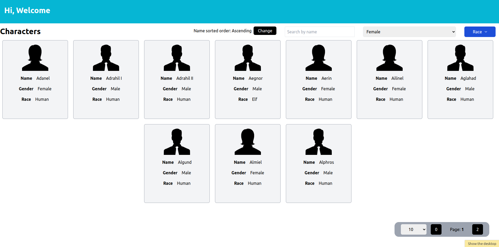

# Lord of the Rings Character List



This web application provides a list of characters from the movie "The Lord of the Rings." It offers several features to make it easy for users to navigate and find characters.

## Features

1. **Sorting by Name:** Users can sort the list of characters alphabetically by name, both in ascending and descending order.

2. **Search by Name:** A search bar allows users to search for characters by their names. The search is implemented using the debounce technique, ensuring a smooth and responsive search experience.

3. **Filtering by Gender:** Users can filter characters by gender, allowing them to narrow down the list based on male and female.

4. **Filtering by Race:** Users can also filter characters by their race, such as humans, elves, dwarves, hobbits, and others.

5. **Pagination:** To manage a large list of characters, the application implements pagination, displaying a limited number of characters per page and allowing users to navigate through the pages.

## Technologies Used

- [React](https://reactjs.org/): A JavaScript library for building user interfaces.
- [Tailwind CSS](https://tailwindcss.com/): A utility-first CSS framework.

## Hosted Application

You can view and interact with the hosted application [here](https://levelx-gray.vercel.app).

## Getting Started

If you want to run this project locally, follow these steps:

1. Clone this repository.
2. Navigate to the project's directory.
3. Install dependencies:
   ```bash
   npm install